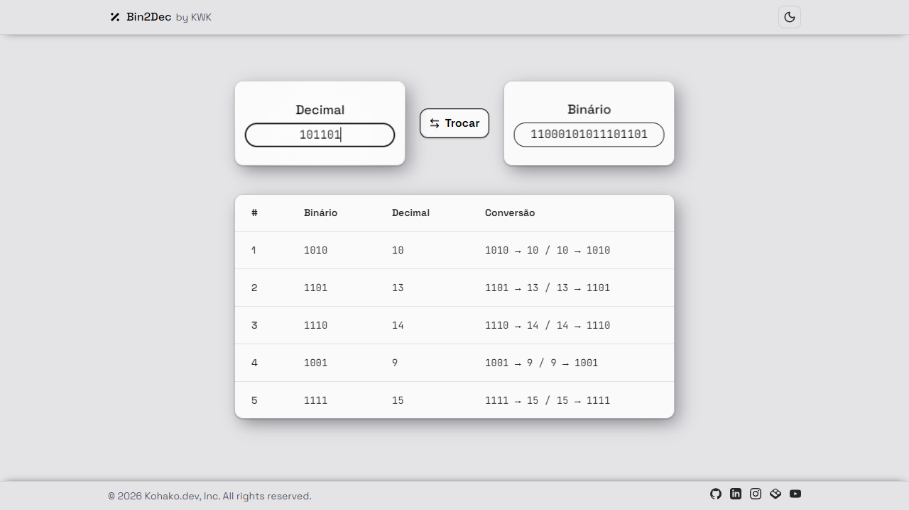
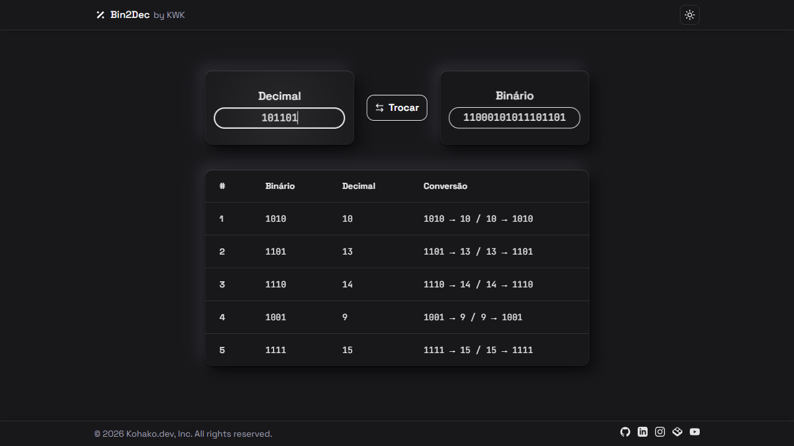

<div align="center">


# Bin2Dec

**Binary ↔ decimal. No size limit, no rounding.**

[](https://react.dev/)
[](https://react.dev/learn/react-compiler)
[](https://www.typescriptlang.org/)
[](https://vite.dev/)
[](https://tailwindcss.com/)
[](https://vitest.dev/)

[**Live demo**](https://bin-two-dec.vercel.app/) · [Português](README.md)

</div>

---

## The short version

You type a number, it gives it back in the other base. Decimal → binary, binary
→ decimal, and the field only accepts what makes sense for the mode it is in —
no letting you type `7` in binary and pretending that worked.

The part I would not give up: **there is no ceiling**. Paste a 300-digit number
and the answer comes out exact, with no friendly rounding along the way. And if
the result outgrows the field, a panel opens with the whole number grouped for
reading, plus the sum of powers of two that gets you there.

The interface is in Portuguese, on purpose.

## The look

Light and dark themes, your choice remembered and applied before the first
paint — none of that white flash on load. The cards have real depth and tilt
along with your cursor; on touch that makes no sense, so it goes away, and
anyone who asked for `prefers-reduced-motion` sees nothing moving.

<!-- To show the screenshots, drop both files in public/ and replace this
     comment with the block below:

| Light | Dark |
|:-----:|:----:|
|  |  |
-->

## Under the hood

Four choices I would make again.

**`BigInt` all the way through.** That is what makes 64 set bits come back as
`18446744073709551615`, exactly. With a regular number, the last digits are
decoration. Input validation follows the mode, so binary takes `0` and `1` and
nothing else.

**The result is derived, not stored.** It comes out of a computation during
render, from the input and the mode. No `useState`, no `useEffect`. One less
piece of state to keep in sync is one less bug to chase later — and React
Compiler memoizes the computation on its own.

**The theme reaches the depth.** Switching themes here does not just change
background and text: the shadow colors live in CSS variables redefined under
`.dark`, so the card depth switches along. An arbitrary `box-shadow` value is
something no `dark:` variant can reach.

**One width, three blocks.** `--content-max` drives the field row, the table
and the panel. The row is a `1fr auto 1fr` grid, so it occupies that width
instead of inferring it from the sum of its children — which is how two blocks
stop lining up without anyone noticing.

## Built with

| | | |
|---|---|---|
| [React](https://react.dev/) | 19 | UI |
| [React Compiler](https://react.dev/learn/react-compiler) | 1.0 | Automatic memoization |
| [TypeScript](https://www.typescriptlang.org/) | 5.7 | Types, strict mode |
| [Vite](https://vite.dev/) | 6.4 | Build and dev server |
| [Tailwind CSS](https://tailwindcss.com/) | 4.3 | Styling, configured in CSS |
| [Vitest](https://vitest.dev/) | 4.1 | Tests |
| [Bun](https://bun.sh/) | 1.2 | Package manager |

## Running it locally

```bash
git clone https://github.com/dev-kohako/BinTwoDec.git
cd BinTwoDec
bun install
bun dev
```

Opens at `http://localhost:5173`. Works the same with `npm` — just know the
committed lockfile here is Bun's.

## Scripts

| | |
|---|---|
| `bun dev` | Dev server with HMR |
| `bun run build` | Type check and production build into `dist/` |
| `bun run preview` | Serve the production build locally |
| `bun run lint` | ESLint, with the React Compiler rules |
| `bun test` | Run the tests |
| `bun run test:watch` | Tests in watch mode |

## Tests

The conversion math lives on its own in `src/lib/conversion.ts`, free of React,
and that is where the tests aim. They run in node, no DOM, and finish before
you take your hand off the keyboard.

```bash
bun test
```

What is pinned are the corners where this kind of code tends to slip: digits
outside the alphabet in binary mode, values past `Number.MAX_SAFE_INTEGER`, a
huge input, empty input and leading zeros. The round-trip uses a fixed-seed
generator instead of `Math.random`, otherwise a failure shows up today and
vanishes tomorrow.

## Where things are

```
src/
├── components/     UI, one file per component
├── hooks/          use-theme (theme) and use-tilt (3D tilt)
├── lib/            conversion.ts and conversion.test.ts
├── types/          shared types
├── App.tsx
├── main.tsx
└── index.css       theme, depth variables and the .card-3d class
```

If you came for the code and want to read just one thing, read
[`src/lib/conversion.ts`](src/lib/conversion.ts). It is the heart of it and
under a hundred lines.

Tailwind 4 needs no `tailwind.config`: theme and variants live in
`src/index.css`, through `@theme` and `@custom-variant`.

## Deploy

Running on [Vercel](https://bin-two-dec.vercel.app/), rebuilt on every push to
`main`.

| | |
|---|---|
| Framework | Vite |
| Build | `bun run build` |
| Output | `dist` |

## License

[MIT](LICENSE) — take it, use it, change it. If it helped, tell me.

## Who made it

**Joseph Kawe**, under the KWK name.

[GitHub](https://github.com/dev-kohako) ·
[LinkedIn](https://www.linkedin.com/in/josephkawe/) ·
[Instagram](https://www.instagram.com/kohako.dev/) ·
[YouTube](https://www.youtube.com/@dev_kohako) ·
[Bento](https://bento.me/kohako)
